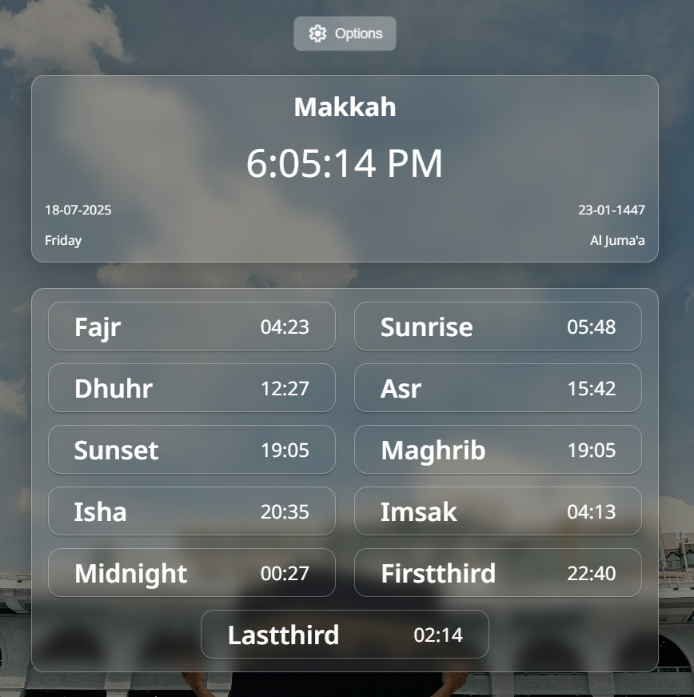
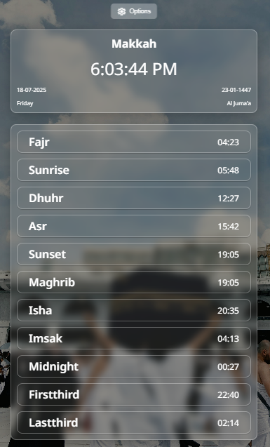

## 🕌 Prayer Times App

A responsive web application that allows users to view daily Islamic prayer times for cities in Saudi Arabia. Users can select a city and date to see accurate prayer schedules based on location and the chosen day.

🌐 **Live Demo**: [https://hibahdesu.github.io/Prayer-Times-App/](https://hibahdesu.github.io/Prayer-Times-App/)


---

### 🌟 Features

* 🕋 Select from **12 major cities** in Saudi Arabia (e.g., Makkah, Riyadh, Medina)
* 📅 Choose any date to view the corresponding prayer times
* 🕌 View Gregorian and Hijri dates and weekday names
* 🕐 Real-time digital clock display
* ✨ Smooth transitions and modal overlay with blur effects
* 🎨 Dynamic background updates based on selected city
* 📱 **Fully responsive** for desktop and mobile devices
* ⚡ Fast data fetching using **Axios** and the [Aladhan API](https://aladhan.com/prayer-times-api)

---

### 📁 Project Structure

```
project-root/
│
├── index.html           # Main HTML file
├── styles.css           # Custom styling and responsive layout
├── scripts.js           # JavaScript functionality
├── images/              # Background images for each city
│   ├── makkah2.jpg
│   ├── mecca.jpg
│   └── ...
├── node_modules/        # Axios library (optional if CDN is used)
└── README.md            # You're here!
```

---

### ⚙️ How It Works

* Prayer data is fetched using the **Aladhan API** via Axios based on city coordinates and selected date.
* The app updates:

  * Real-time clock (`setInterval`)
  * Gregorian and Hijri date information
  * Daily prayer times (Fajr, Dhuhr, Asr, Maghrib, Isha, etc.)
* UI dynamically updates city background and modal form for city/date selection.

---

### 🔧 Technologies Used

* **HTML5**
* **CSS3** (Flexbox, responsive media queries, blur effects)
* **JavaScript** (ES6+, DOM manipulation)
* **Axios** for API requests
* **Google Fonts & Material Symbols** for icons and typography

---

### 🚀 Getting Started

#### 1. Clone or download this repository

```bash
git clone https://github.com/your-username/prayer-times-app.git
```

#### 2. Open `index.html` in your browser

*No build steps needed.*

> ⚠️ Make sure you are connected to the internet for API calls and CDN fonts/icons.

---

### 📸 Screenshots

| Desktop View                          | Mobile View                         |
| ------------------------------------- | ----------------------------------- |
|  |  |


---

### 📌 Notes

* Ensure all city image paths in the `cities` array are correct and accessible.
* You can change the default prayer calculation method via the API (currently using `method: 4` — Umm al-Qura University, Makkah).
* Works best with modern browsers.

---

### 🙏 Acknowledgements

* [Aladhan Prayer Times API](https://aladhan.com/prayer-times-api)
* [Google Fonts](https://fonts.google.com/)
* [Material Symbols](https://fonts.google.com/icons)

---

